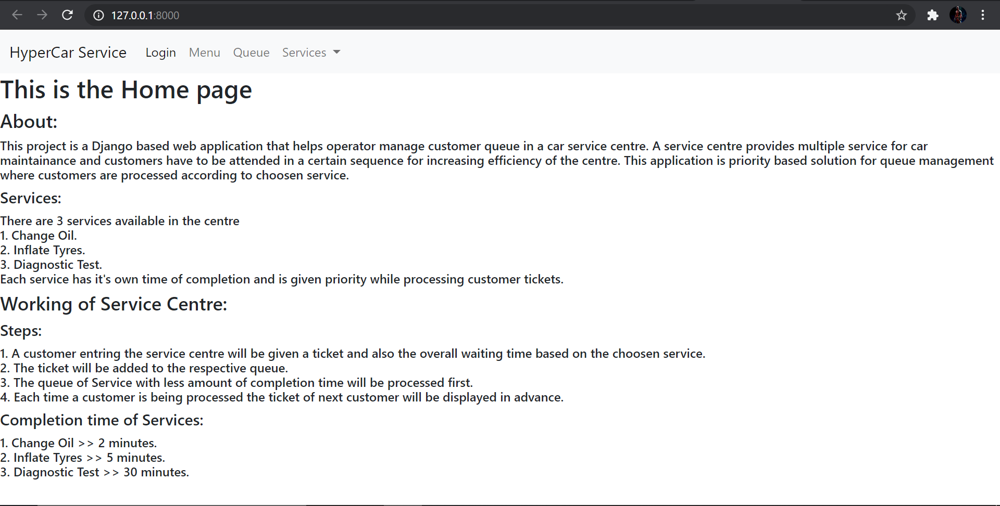
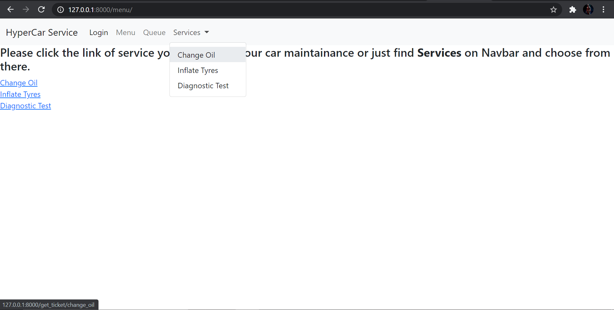

# Project: Hypercar Service Center
## About:
This project is a Django based web application that helps operator manage customer queue in a car service centre. A service centre provides multiple service for car maintainance and customers have to be attended in a certain sequence for increasing efficiency of the centre.
This application is priority based solution for queue management where customers are processed according to choosen service. 
## Services:
There are 3 services available in the centre
1. Change Oil.
2. Inflate Tyres.
3. Diagnostic Test.

Each service has it's own time of completion and is given priority while processing customer tickets.

## Working of Service Centre:
### Steps:
1. A customer entring the service centre will be given a ticket and also the overall waiting time based on the choosen service.
2. The ticket will be added to the respective queue.
3. The queue of Service with less amount of completion time will be processed first.
4. Each time a customer is being  processed the ticket of next customer will be displayed in advance.

### Completion time of Services:
1. Change Oil >> 2 minutes.
2. Inflate Tyres >> 5 minutes.
3. Diagnostic Test >> 30 minutes.

## A short overview of the project:
### 1. Home page: "/"
Just a descriptive page providing informatiion for Service Centre.



### 2. Welcome page: "/welcome"
A welcome page created to greet user after add user authentication (most probably for operator/mechanic).
### 3. Menu page: "/menu"
Allows operator to select appropriate service asked by customer. 



### 4. Token_details: "/get_ticket/<str:service_name>"
Displays details of issued ticket for customer and estimate waiting time.


### 5. Electronci Queue: "/processing"
Will show number of unprocessed customers in respective queues.


### 6. Serving Next Client: "/next"
Process the current ticket and update the line. Show the next one on the main panel.(This page is a post request redirected from "/processing").


#### Note: The menu can also be directly accesed from the navigation bar as the user authentication is not yet added and is much easier to do so.

## Installation
### Step 1: Open your git bash and clone the repository.
```bash
git clone https://github.com/HMHarris-git/JetBrains_hyperskill.git
```
### Step 2: Open the 'HyperCar_Service' directory.
```bash
cd HyperCar_Service
```
### Step 3: Download dependencies for the project.
For Linux :
```bash
pip3 install -r requirements.txt 
```
For Windows :
```bash
python -m pip install -r requirements.txt 
```
### Step 4: Run the server getting in the 'hypercar' directory
```bash
cd hypercar
python manage.py runserver
```
### Step 5: Open the local host on port 8000 (default) in your browser and explore the application.
```
http://127.0.0.1:8000/
```
